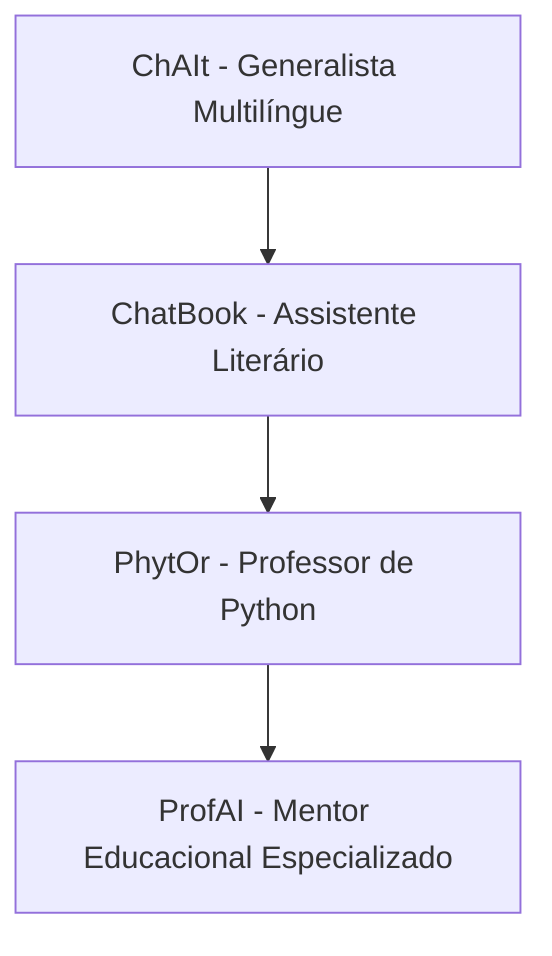

# 🤖 Chatbots Educacionais com LLMs

Quatro assistentes inteligentes construídos com LLMs e interface Gradio para fins educacionais, explorando desde interações generalistas até especializações em literatura, ensino de Python e orientação acadêmica.

---

## 1. ChAIt – Chatbot Generalista Multilíngue
[🔗 Link para o projeto ChAIt](#)

Um chatbot de uso geral com diferencial multilíngue. Reconhece a linguagem do usuário e responde de forma contextualizada, utilizando:

- **OpenRouter API Key**
- **LLM: DeepSeek**
- **Temperatura ajustável:** entre 0.3 e 0.7 para controlar criatividade
- **Tokens limitados para controle de contexto**
- **Interface Gradio (modelo soft com background clean)**

### Diferenciais
- Responde em diferentes idiomas sem troca manual
- Permite configuração de temperatura e número de tokens
- Interface amigável para diferentes perfis de usuários

---

## 2. ChatBook – Instrutor Literário
[🔗 Link para o projeto ChatBook](#)

Um assistente virtual voltado para literatura, que atua como curador e instrutor de leitura, oferecendo:

- Recomendações de livros com base no gosto do usuário
- Respostas a dúvidas literárias
- Prompt customizado para diálogo literário
- Interface Gradio personalizada com arte clássica e fontes serifadas

### Diferenciais
- Prompt especializado para atuação como bibliotecário ou instrutor
- Ajuste fino da temperatura para sugestões criativas e empáticas

---

## 3. PhytOr – Instrutor de Python
[🔗 Link para o projeto PhytOr](#)

Chatbot professor para apoio em ensino de Python, ideal para iniciantes:

- Treinado com prompt baseado em didática educacional
- Oferece exemplos de código, explicações de erros e boas práticas
- Pode atuar como assistente em sala de aula

### Diferenciais
- Interface Gradio clara, com bloco de código e destaque de sintaxe
- Ajuste da temperatura para reduzir ambiguidade em respostas técnicas

---

##  4. ProfAI – Orientador Acadêmico Inteligente
[🔗 Link para o projeto ProfAI](#)

Chatbot especialista em capacitação, orientação educacional e desenvolvimento de carreira:

- Prompt com roteirização de perguntas por área de formação
- Funções personalizadas de memória de contexto
- Planejamento de carreira baseado nas respostas do usuário

### Diferenciais
- Lógica de prompt altamente especializada
- Capacidade de simular entrevistas de estágio e dar feedbacks

---

## Fluxo de Evolução dos Chatbots



---

## Sobre o Projeto

Este projeto foi criado como parte de um experimento educacional para explorar o poder das **LLMs**, **embeddings** e **sistemas conversacionais com foco em educação, literatura e carreira**.

Ideal para estudantes, professores, profissionais em transição ou qualquer pessoa que deseje **aprender com inteligência artificial de forma acessível e personalizada**.

---

## Bootcamp

Projeto desenvolvido durante o **Bootcamp de LLM (Modelos de Linguagem de Grande Escala)** da **SoulCode Academy**, com apoio do **Grupo Petrópolis**.

---

## 📄 Licença

Distribuído sob a licença MIT. Veja o arquivo `LICENSE` para mais informações.

---

<div align="center">  
  <p>Desenvolvido com ❤️ por <a href="https://github.com/crislenenunes">Crislene Nunes</a> durante o Bootcamp de IA LLM da SoulCode</p>  
    
    
    
</div>
```
